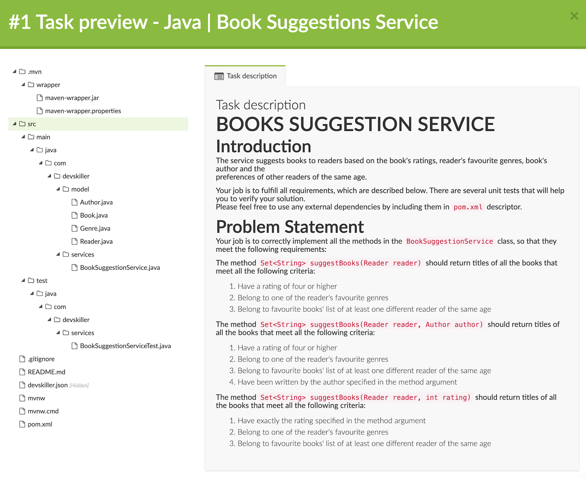

# unit-streaming
Unit Testing for Streaming Project

## Collections

ทั้ง List, Set และ Map เป็น interface
* ArrayList และ LinkedList เป็น Implementation ของ List
* HashSet กับ TreeSet เป็น Implementation ของ Set
* HashMap กับ TreeMap เป็น Implementation ของ Map

```
'-- List
'   '-- ArrayList
'   '-- LinkedList
'-- Set
'   '-- HashSet
'   '-- TreeSet
'-- Map
    '-- HashMap
    '-- TreeMap
```

ระบบขนาดใหญ่ นิยมบังคับชนิดข้อมูล และตั้งชื่อตัวแปรเป็น Plural เช่น
```java
List<String> data = new ArrayList<>();
Set<String> users = new HashSet<>();
```

Method ที่ควรรู้
```java
add("Latte")      // ใส่คำว่า "Latte" เข้าไป

remove("Latte")   // เอาคำว่า "Latte" ตัวแรกออกไป

contains("Latte") // ตรวจสอบดูว่ามี "Latte" หรือเปล่า

size()            // จำนวนข้อมูลที่มีทั้งหมด
```

ใช้ Enhanced For-Loop จะง่ายกว่า
```java
Set<String> users = new HashSet<>();
users.add("Frank L");
users.add("David B");
for (String s : users) {
    System.out.println(s);
}
```

พวก Primitive Data จะถูกแปลงเป็น Instance 
```java
List<Integer> a = new ArrayList<>();
a.add(5);
a.add(7);
for (Integer i : a) {
    if (i instanceof Integer) {
        System.out.println("OK");
    }
}
```

ตัวอย่างการเขียน Method นับเลขคู่จาก List<Integer>
```java
int count(List<Integer> data) {
    int t = 0;
    for (Integer e : data) {
        if (e % 2 == 0) {
            t++;
        }
    }
    return t;
}
```
แบบฝึกหัด จาก Class ที่กำหนดให้ เขียน Method หาว่ามี Square กี่อัน
```java
class Rectangle {
    public Rectangle(double w, double h) {
        this.width = w;
        this.height = h;
    }
    double width, height;
    public double getWidth() { return width; }
    public double getHeight() { return height; }
}
class Sample {
    int count(List<Rectangle> data) {
        .
        .
        .
    }
}
```

## HashSet 
ใน add() ของ HashSet จะเรียก hashCode() 
เพื่อหา Slot ที่เหมาะสม 
และเรียก equals() เพื่อหาตัวซ้ำใน Slot นั้น
ถ้าไม่มีตัวซ้ำก็ใส่ข้อมูลเข้าไป


เข้าไปแล้วจะเจอหน้านี้

เลือกอันที่ 3 เลย สะดวกสุด



