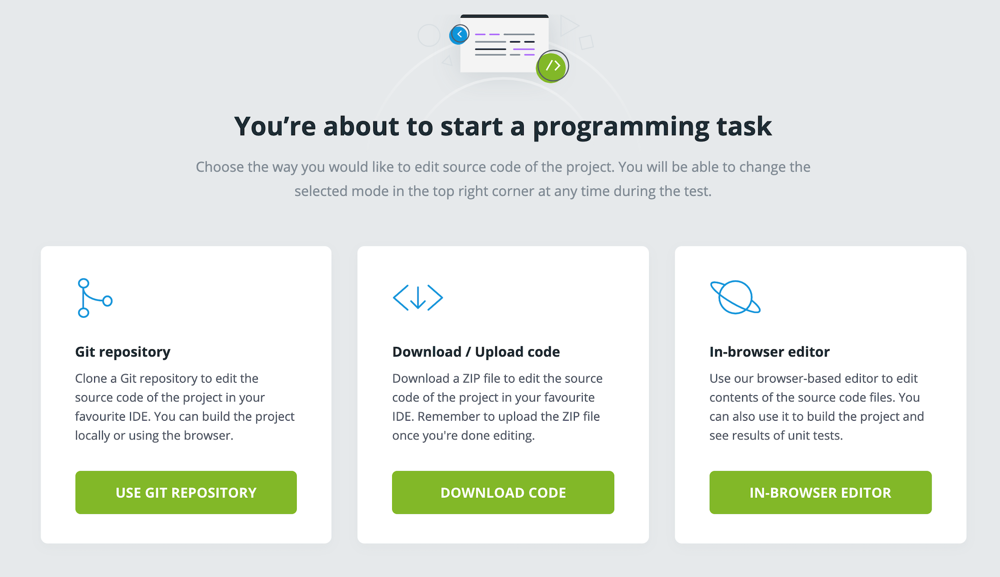

# unit-streaming
Unit Testing for Streaming Project

## Collections
สิ่งที่ควรรู้เกี่ยวกับ Collections
```
'-- List
'	'-- ArrayList
'	'-- LinkedList
'-- Set
'	'-- HashSet
'	'-- TreeSet
'-- Map
	'-- HashMap
	'-- TreeMap
```
ทั้ง List, Set และ Map จะเป็น interface
ส่วน ArrayList และ LinkedList เป็น Implementation
ของ List
และ HashSet กับ TreeSet เป็น Implementation ของ Set

เข้าไปแล้วจะเจอหน้านี้

เลือกอันที่ 3 เลย สะดวกสุด

